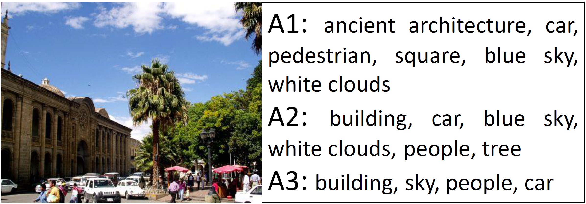

# Diverse Image Annotation (CVPR 2017)
 
This project introduces our work "Diverse Image Annotation" published at CVPR 2017. 

```
Baoyuan Wu, Fan Jia, Wei Liu, Bernard Ghanem. 
"Diverse Image Annotation".
IEEE Conference on Computer Vision and Pattern Recognition (CVPR 2017), Honolulu, Hawaii, USA 
```
The goal of diverse image annotation (DIA) is to cover as much useful information of an
image as possible using a limited number of tags. 
It requires the tags to be not only representative to
the image, but also diverse from each other to reduce redundancy. DIA can be seen as a redefinition of the automatic image annotation (AIA), to encourage the results of AIA to be more close to human annotations.

Why Diverse Image Annotation & Observations of Human Annotations
----
In current automatic image annotation (AIA), the general target is to predict most relevant tags of the image. 
However, we find that there are obvious differences between the results of AIA and the ones of human annotations, 
at both the number of predicted tags and the quality of the predicted tag subset.  

Let's start with an observation of how human annotates images. We conduct a subject study by asking 3 human annotators to annotate 500 test images of IAPRTC-12 independently, with the instruction "cover the main contents of one image using a few tags". 
Based on the human annotation results, we have two observations:
```
1. The number of annotated tags of all annotations lay in a small range, with the average around 4 (see Fig 1).
2. In each annotation, it is rare to give redundant tags together (see Fig 2).
```

Fig 1. Statistics of tag numbers of three human annotators
<!--  -->

Fig 2. Three independent human annotations of one image

Human Annotations
----

Some results and statistics


Our model
----

##Semantic Paths


##Sampling


